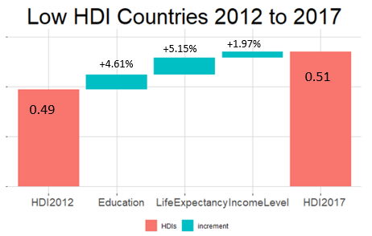
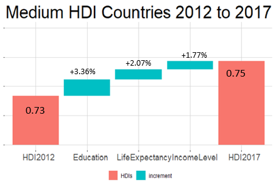

# VisualizingInequality-HumanDevelopmentIndex-2018
Visualize the components of Human Development Index as a waterfall

Human Development Index (HDI) is a geometric mean of its 3 component indices - Life Expectancy Index,  Education Index,  Income Index.

Here we try to view the changes in respective components leading to overall change in HDI.

### LOW HDI COUNTRIES -

### MEDIUM HDI COUNTRIES -

### HIGH HDI COUNTRIES -

DATA SOURCE: http://hdr.undp.org/sites/default/files/hdi_series_cartagena.xlsx
