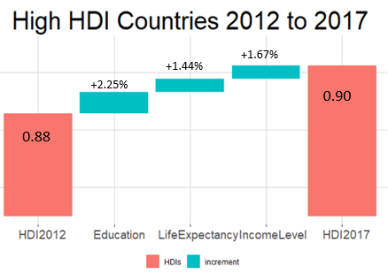

# VisualizingInequality-HumanDevelopmentIndex-2018
Visualize the components of Human Development Index as a waterfall

Human Development Index (HDI) is a geometric mean of its 3 component indices - Life Expectancy Index,  Education Index,  Income Index.

Here we try to view the changes in respective components leading to overall change in HDI.

Please note that in following graphs the bars representing contributing factors are on a log-scale and the linear shifts in contributing factor (mentioned in %) will not add up to actual gap in total HDI due to non-linearity of geometric mean.

### LOW HDI COUNTRIES -

### MEDIUM HDI COUNTRIES -

### HIGH HDI COUNTRIES -

DATA SOURCE: http://hdr.undp.org/en/content/download-data
